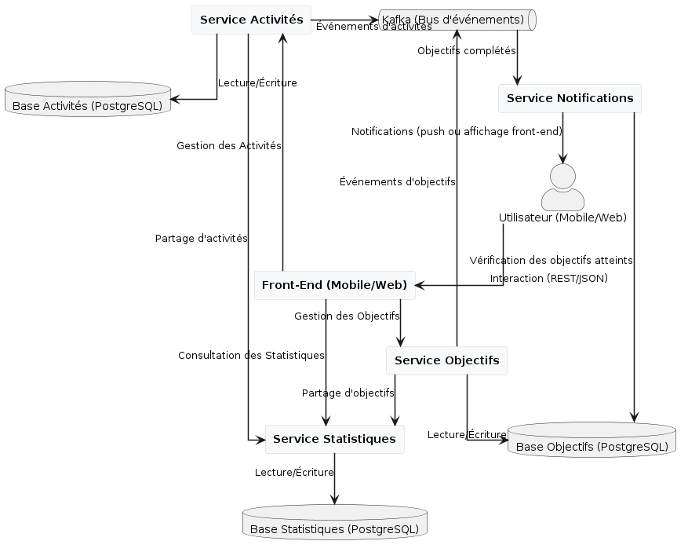
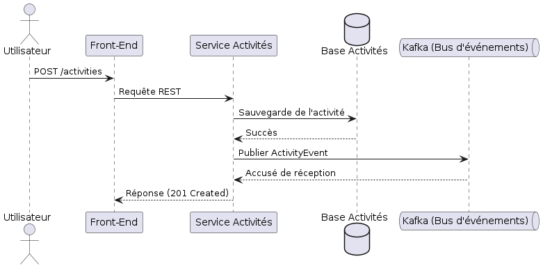
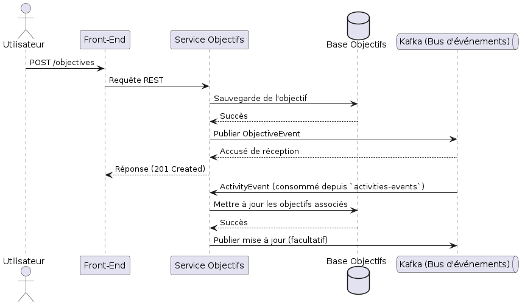
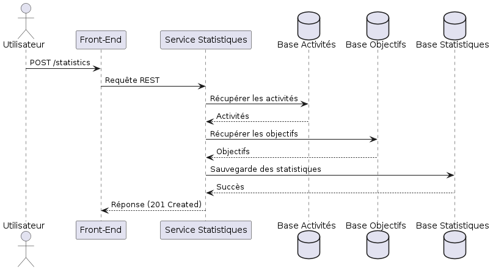
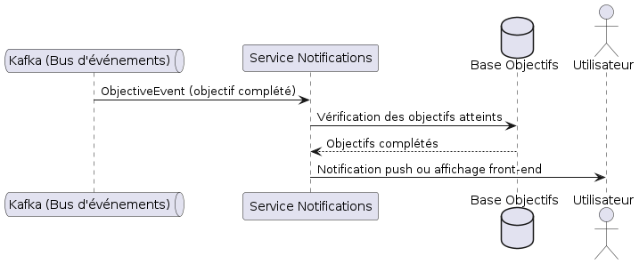

# PulseTracker

## Réalisé par

**Hamza MADDOUCH**

---

## Sommaire

1. [Description du Projet](#description-du-projet)
2. [Dossier d'Architecture](#dossier-darchitecture)
   - [Gestion des Activités](#gestion-des-activités)
   - [Gestion des Objectifs](#gestion-des-objectifs)
   - [Visualisation des Progrès](#visualisation-des-progrès)
   - [Notifications et Rappels](#notifications-et-rappels)
3. [Diagrammes de Conception](#diagrammes-de-conception)
   - [Architecture Principale](#1-architecture-principale)
   - [Diagramme de Séquence du Service Activités](#2-diagramme-de-séquence-du-service-activités)
   - [Diagramme de Séquence du Service Objectifs](#3-diagramme-de-séquence-du-service-objectifs)
   - [Diagramme de Séquence du Service Statistiques](#4-diagramme-de-séquence-du-service-statistiques)
   - [Diagramme de Séquence pour Notifications](#5-diagramme-de-séquence-pour-notifications)
4. [Justification de l'Architecture et des Technologies](#justification-de-larchitecture-et-des-technologies)
5. [Installation et Exécution](#installation-et-exécution)

---

## Description du Projet

**PulseTracker** est une application de suivi de santé qui permet aux utilisateurs de gérer leurs activités, leurs objectifs et de suivre leurs progrès. L'application repose sur une architecture microservices, chaque service étant dédié à une fonctionnalité spécifique : gestion des activités, gestion des objectifs, calcul des statistiques, et affichage des notifications. Le projet intègre des technologies modernes comme Kafka pour la communication interservices et PostgreSQL pour la persistance des données.

---

## Dossier d'Architecture

### Tableaux d’Architecture par Fonctionnalité

#### Gestion des Activités

Ce tableau détaille la manière dont le système gère l’enregistrement des activités physiques de l’utilisateur, ainsi que les choix techniques et les justifications associées. Il aborde notamment la séparation en microservice, l’utilisation d’une API REST pour le CRUD d’activités, et l’intérêt de l’ORM pour simplifier les opérations de persistance.

| **Fonctionnalité**     | Gestion des Activités                                                                                             |
|-------------------------|------------------------------------------------------------------------------------------------------------------|
| **Description**         | L’utilisateur enregistre des activités (course, vélo, etc.), avec détails (durée, distance, calories brûlées…)  |
| **Décision d’Architecture** | Créer un microservice dédié “Activités” exposant une API REST pour le CRUD d’activités                     |
| **Patterns**            | REST (communication front/back), ORM (PostgreSQL), IoC/DI, Kafka (activities-events)                            |
| **Justification**       | Séparer la gestion des activités dans un service autonome facilite l’évolutivité et les évolutions futures       |
| **Implications**        | - Base de données propre au microservice                                                                         |
|                         | - Service accessible en REST/JSON                                                                               |
|                         | - Publication des événements sur Kafka (création d’activité)                                                   |
| **Dépendances**         | Communique avec “Objectifs” (progression) et “Statistiques” (agrégation des données)                             |

---

#### Gestion des Objectifs

Ce tableau expose les décisions d’architecture relatives à la définition et au suivi d’objectifs de fitness personnalisés. Il met en avant la logique métier centralisée dans un microservice “Objectifs” et décrit les dépendances essentielles, telles que la communication REST avec les autres services et la publication éventuelle d’événements pour déclencher des notifications.

| **Fonctionnalité**     | Gestion des Objectifs                                                                                            |
|-------------------------|------------------------------------------------------------------------------------------------------------------|
| **Description**         | L’utilisateur définit des objectifs (durée, calories, distance) et le système suit l’avancement                 |
| **Décision d’Architecture** | Créer un microservice “Objectifs” exposant une API REST pour gérer les objectifs et consulter leur avancement |
| **Patterns**            | REST (exposition/consommation), ORM, IoC/DI, Kafka (consommation d’activities-events)                           |
| **Justification**       | Centraliser la logique métier des objectifs facilite leur maintenance et évolution                               |
| **Implications**        | - Recevoir les infos d’activités pour mise à jour des objectifs                                                 |
|                         | - Consommer les topics Kafka (activities-events)                                                               |
| **Dépendances**         | Reçoit des données du service “Activités”                                                                       |

---

#### Visualisation des Progrès

Cette section présente l’architecture retenue pour la création et la consultation de rapports, statistiques et tableaux de bord. Le tableau met l’accent sur l’utilité d’un service spécialisé “Statistiques & Rapports” pour agréger les données.

| **Fonctionnalité**     | Visualisation des Progrès                                                                                       |
|-------------------------|----------------------------------------------------------------------------------------------------------------|
| **Description**         | Tableau de bord et statistiques sur la progression                                                            |
| **Décision d’Architecture** | Mettre en place un service “Statistiques” pour agréger les données des microservices “Activités” et “Objectifs” |
| **Patterns**            | REST pour requêtes, IoC/DI                                                                                    |
| **Justification**       | Centraliser les calculs/statistiques dans un service dédié simplifie l’extraction de données                  |
| **Implications**        | - Consomme les APIs REST des services “Activités” et “Objectifs”                                              |
| **Dépendances**         | Communique avec les services “Activités” et “Objectifs”                                                       |

---

#### Notifications et Rappels

Dans ce dernier tableau, on décrit la stratégie d’envoi de notifications (push, mails, toasts web) et la gestion des préférences utilisateur.

| **Fonctionnalité**     | Notifications et Rappels                                                                                       |
|-------------------------|----------------------------------------------------------------------------------------------------------------|
| **Description**         | Envoi de notifications (push, email, toasts web) sur les objectifs atteints                                   |
| **Décision d’Architecture** | Intégrer une page de notifications dans le front qui interroge les données du service “Objectifs”           |
| **Patterns**            | REST (front-service Objectifs)                                                                                |
| **Justification**       | Les notifications doivent être déclenchées par des événements d’objectifs atteints                            |
| **Implications**        | Nécessite une interrogation régulière des objectifs via API                                                   |
| **Dépendances**         | Interagit avec le service “Objectifs” pour afficher les notifications                                          |


---

## Diagrammes de Conception

### 1. Architecture Principale



L'architecture principale est basée sur une structure de microservices. Les services suivants sont intégrés :

- **Service Activités** : Gère la création, la modification et la suppression des activités.
- **Service Objectifs** : Gère la définition et le suivi des objectifs personnels.
- **Service Statistiques** : Calcule et stocke des statistiques basées sur les activités et les objectifs.
- **Front-End** : Fournit une interface utilisateur pour interagir avec les services.
- **Kafka** : Gère les communications interservices via des topics (e.g., `activities-events`).
- **PostgreSQL** : Fournit la persistance pour les données des activités, objectifs et statistiques.

---

### 2. Diagramme de Séquence du Service Activités



- L'utilisateur soumet une activité via le front-end.
- L'activité est sauvegardée dans la base de données.
- Un événement est publié dans Kafka (`activities-events`) pour informer d'autres services.

---

### 3. Diagramme de Séquence du Service Objectifs



- L'utilisateur soumet un nouvel objectif via le front-end.
- L'objectif est sauvegardé dans la base de données.
- Le service consomme les événements de Kafka (`activities-events`) pour mettre à jour les objectifs associés (distance, durée, calories).

---

### 4. Diagramme de Séquence du Service Statistiques



- Les statistiques sont calculées en récupérant les données des services `Activities` et `Objectives` via leurs endpoints REST.
- Les résultats sont sauvegardés dans la base de données des statistiques.

---

### 5. Diagramme de Séquence pour Notifications



- Le service `Objectifs` met à jour les objectifs en fonction des événements reçus.
- Les objectifs atteints sont identifiés et sauvegardés avec un statut `completed`.
- Le front-end interroge régulièrement les objectifs pour afficher les notifications concernant les objectifs complétés.

---


## Justification de l'Architecture et des Technologies

### Architecture Microservices
- **Scalabilité** : Chaque service peut être développé, déployé et mis à l'échelle indépendamment.
- **Flexibilité** : Les services sont découplés, facilitant les évolutions futures.
- **Responsabilité Unique** : Chaque service est responsable d'une fonctionnalité spécifique.

### Kafka pour la Communication Interservices
- **Réactivité** : Kafka permet une communication asynchrone entre les services.
- **Tolérance aux Pannes** : Les messages peuvent être persistés et rejoués en cas de panne.
- **Scalabilité** : Kafka supporte un grand volume de messages.

### PostgreSQL pour la Persistance
- **Fiabilité** : PostgreSQL est robuste et supporte les transactions ACID.
- **Performances** : Supporte des requêtes complexes tout en étant performant.

### Technologie Utilisée
- **Java (Jakarta EE)** : Framework mature et adapté pour les applications distribuées.
- **Maven** : Gestionnaire de dépendances pour simplifier la construction du projet.
- **GlassFish** : Serveur d'applications pour déployer les microservices.
- **PlantUML** : Utilisé pour créer les diagrammes de conception.

---

## Installation et Exécution

### Prérequis
- Java 11 ou supérieur
- Maven
- GlassFish 7
- Kafka et Zookeeper
- PostgreSQL

### Étapes (sur la VM insa)
0. Exécutez : 
    ```bash 
    ./start-server.sh
1. Clonez le projet : `git clone https://github.com/Maddouchhamza/PulseTracker`
2. Configurez les bases de données et pools JDBC pour chaque service.
3. Lancez Kafka et Zookeeper.
4. Compilez et déployez chaque service (activities, objectives, statistics)
  **Exemple:**
   ```bash
   cd activities-service/activities-service
   mvn clean package
   cp target/activities-service.war $GLASSFISH_HOME/domains/domain1/autodeploy
5. Lancer le serveur frontend : python3 -m http.server 8000
6. Allez sur http://localhost:8000/index.html (Attention: http://0.0.0.0:8000/index.html ne marche pas!)
7. C'est parti, explorer les différentes fonctionnalités